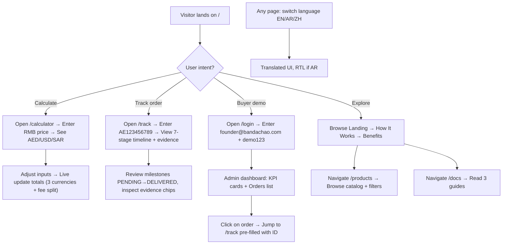

# BandaChao Platform — Product Requirements Document (PRD)

## 1. Product Overview

BandaChao FZ-LLC is a smart cross-border e-commerce import platform based in RAKEZ Free Zone, UAE (Commercial Broker + E-Commerce Portal + Media licenses). This demo application is built specifically to increase the business valuation by showcasing a live, working platform to potential acquirers.

- **Purpose**: Demonstrate an end-to-end smart import workflow from 1688 (China) to UAE/KSA with transparent 7-stage order tracking, multi-currency pricing, and admin analytics.
- **Target Users**: Potential buyers/investors evaluating the company (TRN: 105281937000001), wholesale importers, e-commerce entrepreneurs, and supply chain managers.
- **Business Value**: Validate operational readiness and technology assets across 3 active trade licenses, accelerating the sales process.

---

## 2. Core Features

### 2.1 User Roles

| Role | Login Method | Core Permissions |
|------|-------------|-----------------|
| Public Visitor | No auth required | Browse landing page, use pricing calculator, track orders by ID, view catalog, read docs |
| Admin / Founder | Email + password mock login | Access dashboard analytics, view full order list, inspect milestones, manage data view |

### 2.2 Feature Module (Page Inventory)

1. **Landing Page (/):** Hero with BandaChao branding, 3 platform benefits, 3-step "How It Works", calculator teaser, CTAs.
2. **Pricing Calculator (/calculator):** Multi-currency RMB→AED/USD/SAR calculator with shipping, 10% commission split, and transparent breakdown.
3. **Login Page (/login):** Simple mock authentication (founder@bandachao.com / demo123) that redirects to dashboard.
4. **Admin Dashboard (/dashboard):** Summary KPI cards, orders list table, milestone status badges.
5. **Order Tracking (/track):** Input order ID, visual 7-stage timeline with milestone evidence, order metadata display.
6. **Product Catalog (/products):** Grid of products (Arabic + Chinese names) with category, supplier, and pricing.
7. **Documentation (/docs):** How to Place an Order, 7 Milestones Explained, Fees & Commissions.
8. **Global**: Language switcher (EN / AR / ZH), RTL layout for Arabic, responsive navigation.

### 2.3 Page Details

| Page Name | Module Name | Feature Description |
|-----------|-------------|--------------------|
| Landing | Hero section | Bold panda/black theme, headline + subheadline, dual CTAs (Login / Start Calculator), animated gradient mesh background. |
| Landing | Platform Benefits | 3 icon cards: Transparent Milestones, Multi-Currency Engine, Licensed & Compliant. |
| Landing | How It Works | 3 numbered steps: Source → Ship → Deliver with subtle illustrations. |
| Landing | Calculator Teaser | Inline input for sample RMB price → instant AED result, "Open Full Calculator" button. |
| Pricing Calculator | Input Panel | Sliders/inputs for supplier price (RMB), weight for shipping estimate, optional insurance toggle. |
| Pricing Calculator | Breakdown Panel | Collapsible table: Supplier Cost → Shipping → Platform 10% Fee → Owner/Dev/Legal/Silk Road split → TOTAL per currency. |
| Pricing Calculator | Currency Output | 3 side-by-side cards (AED / USD / SAR) with big bold totals. |
| Login | Auth Form | Email + password fields, "Demo Credentials" hint box, error toast, redirect on success. |
| Dashboard | KPI Cards | 4 stat cards: Total Orders, Active Orders, Revenue AED, Commissions Earned — with trend arrows. |
| Dashboard | Orders Table | Paginated list with tracking #, customer, amount, currentStage pill, actions. |
| Dashboard | Milestones Preview | Quick status dots (7) per order row with color coding. |
| Order Tracking | Search Input | Order ID search with seeded sample "AE123456789" placeholder. |
| Order Tracking | Timeline | Vertical 7-step timeline (PENDING → APPROVED → PROCURED → INSPECTED → PACKAGED → SHIPPED → DELIVERED) with icons, completed dates, evidence chips. |
| Order Tracking | Order Summary | Product name (AR/ZH), customer, total, order date, tracking code block. |
| Product Catalog | Grid | 3-col desktop, 1-col mobile grid, product cards with picsum images, labels. |
| Product Catalog | Filters | Category filter (cars / premium / trend), supplier, price range (client-side). |
| Docs | 3 Guide Articles | Step-by-step order flow, milestone explanations with timeline mini-preview, fee breakdown table matching calculator. |
| Global | i18n Nav | Language selector dropdown EN/العربية/中文; full page reload of translated copy; RTL layout + right-align text when AR active. |

---

## 3. Core Process

**Main User Flow Description (Acquirer Walkthrough):**
1. Acquirer opens the site → sees bold BandaChao hero with CTAs.
2. Clicks "Try Pricing Calculator" → enters a sample product RMB cost → gets real-time AED/USD/SAR final price with 10% split breakdown.
3. Returns to home → clicks "Track an Order" → enters AE123456789 → visual 7-stage timeline shows which milestones are done with dates and evidence.
4. Clicks "Admin Login" → uses seeded credentials → dashboard shows 4 KPI cards and a table of all orders with quick status dots.
5. Browses /products and /docs to validate depth.
6. Tries language switch from EN → AR (RTL) → ZH to verify i18n coverage.

---

## 4. User Interface Design

### 4.1 Design Style

**Aesthetic**: **Luxury Minimalist — Panda Monochrome.**
- **Dominant palette**: Black (#000000), Near-black (#0a0a0a), White (#ffffff), Off-white (#fafafa).
- **Primary accent**: Panda-green accent for highlights (#22c55e) — sparingly, only for "completed / OK" states and primary CTA hover.
- **Status system**: Slate-500 (pending), Amber-500 (in progress), Emerald-500 (done / approved), Rose-500 (alert / dispute).
- **Button style**: Rounded-xl (14px), pill-style, 400 weight label, subtle black border for ghost buttons. Shadow elevation on hover.
- **Fonts**:
  - Display: `Instrument Serif` for H1 hero headlines (refined serif, editorial feel).
  - Body + UI: `Geist Sans` (modern, crisp sans — 14px/150% body, 12px captions).
  - Numbers: `JetBrains Mono` for prices and IDs (tabular numerals for consistent vertical alignment).
- **Layout style**: Top fixed navbar with logo + links + language switcher + login button. Sections use max-w-7xl centered, generous section vertical padding (py-24), asymmetric hero grid with large headline on left, callout card on right.
- **Backgrounds**: Subtle noise grain (SVG) overlay on pure black hero + gradient mesh panda-eyes blobs softly glowing white/light-gray.
- **Icons**: Lucide React line icons, 1.125x scale in buttons, consistent stroke width 2.
- **Emoji/Illustrations**: Use stylized 🐼 panda emoji only in hero and footer. Avoid generic clip-art — rely on typography, spacing, and noise texture for personality.

### 4.2 Page Design Overview

| Page Name | Module | UI Elements |
|-----------|--------|-------------|
| Landing | Hero | Black bg + noise + radial white glow behind headline. H1 Instrument Serif 64/72 desktop, subhead Geist 18/28 slate-300. Dual CTA buttons. Right side: floating calculator preview card (white, shadow-xl, soft border 1px white/10) showing sample AE123456789. Staggered fade-in on page load (150ms steps). |
| Landing | Benefits | 3 equal cards on soft gray-50 section bg. Each card: rounded-2xl white, p-8, border 1px gray-200, 64x64 colored icon tile, H3 Geist 20 semibold, p Geist 15 gray-600. Subtle lift on hover (translate-y-1, shadow-md). |
| Landing | How It Works | Numbered 1/2/3 — large 72pt Instrument Serif numbers layered under white circular 40x40 icon markers. |
| Calculator | Inputs + Outputs | 2-column (desktop) single (mobile). Left: stacked form inputs with label + helper text. Right: 3 currency totals cards (color tinted borders). Below both: accordion "Show Fee Split" with 5 rows. |
| Dashboard | KPIs + Table | 2×2 grid metric cards at top (bg-white border-gray-200). Table: sticky header, row hover bg-gray-50, stage pills, action links to /track. |
| Order Tracking | Timeline | Vertical 72px-spacing steps with circle connectors, completed = solid green fill + check icon, active = pulsing amber ring + icon, pending = gray outline. Evidence chips: rounded-full badges with file icon. |
| Global | Nav | Sticky backdrop-blur-md bg-black/70 border-b border-white/10, white text. On scroll: border opacity increases. |

### 4.3 Responsiveness

- **Desktop-first approach** (max-w-7xl grid layouts at ≥1024px).
- **Tablet (768–1023)**: 2-column collapses where used → single column with narrower max-w-3xl.
- **Mobile (<768px)**: Navbar collapses to hamburger menu (slide-in sheet), all grids 1 column, hero 56px/64 headline, tighter paddings py-16, full-width buttons, sticky CTA at bottom of home.
- **Touch optimization**: All tap targets ≥44×44, buttons increase height on mobile (h-12 vs h-11), timeline steps increase hit area with larger invisible padding wrapper.

---
