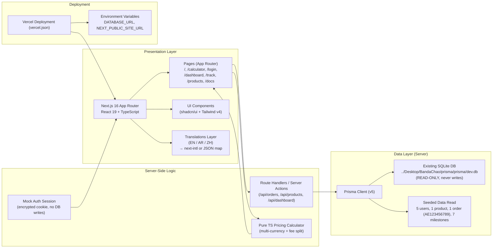
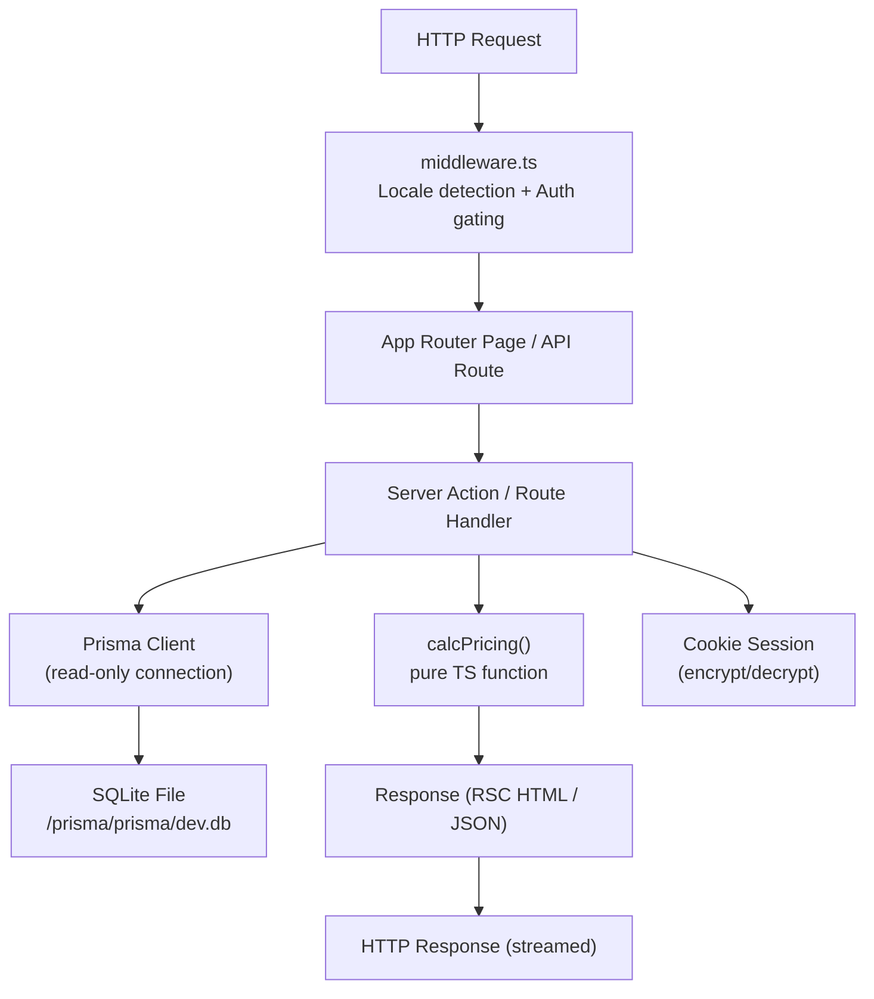
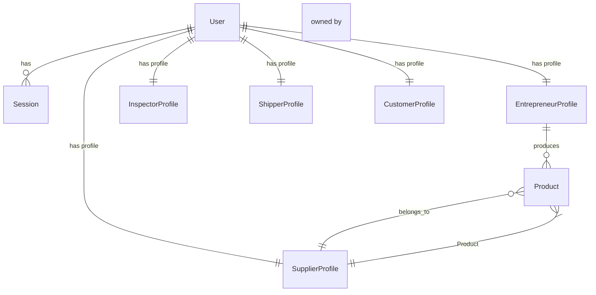

# BandaChao Platform — Technical Architecture Document

## 1. Architecture Design



## 2. Technology Description

| Layer | Choice | Justification |
|-------|--------|---------------|
| Frontend Framework | Next.js 16 (App Router) | User requirement. Full server components by default for fast first load, streaming, and easy server data fetching from Prisma. |
| UI Runtime | React 19 | Latest with server components + actions natively. |
| Language | TypeScript (strict: true) | Type-safe all data paths — critical since Prisma schema types + calculator math are core demo value. |
| Styling | Tailwind CSS v4 | Zero-config, zero JS runtime, user requirement. v4 `@theme` for tokens inside CSS. |
| UI Primitives | shadcn/ui (latest) | Professional accessible components. Install: Button, Card, Input, Table, Badge, Accordion, Dialog, Tabs, Progress, Timeline (or built custom). |
| Icons | lucide-react | Per skill guidelines. |
| Database ORM | Prisma v5 | Connects to the existing SQLite DB without schema changes. Re-uses the `Desktop/BandaChao/prisma/schema.prisma` via symlinked or copied `prisma/` folder. |
| Database File | SQLite (read-only) | Existing `../Desktop/BandaChao/prisma/prisma/dev.db` via `DATABASE_URL=file:...` environment variable. |
| Auth | Simple encrypted cookie (iron-session or next.js cookies + jose) | Mock auth only; no schema writes; on successful login issue session cookie with `role=admin`, on middleware protect `/dashboard*`. |
| i18n | `next-intl` plugin + 3 JSON locale files | Routing: `/en/`, `/ar/`, `/zh/` locales; middleware locale detection + cookie fallback; ar locale enables `dir="rtl"` on `<html>`. |
| Fonts | next/font/google — Geist Sans + Instrument Serif + JetBrains Mono | Self-hosted zero-FOIT, design system in PRD §4.1. |
| Deployment | Vercel (vercel.json) | User requirement. SQLite runs on serverless via Vercel Functions. Note: preview URLs may use a copied DB file into `./data/` since relative paths can break on Vercel FS. |
| Build | `npm run build` (next build) | Strict check — must exit 0, no TS errors. |

## 3. Route Definitions

| Route (locale-prefixed) | Page Component | Purpose | Data Fetch |
|-------------------------|---------------|---------|------------|
| `/` | `app/[locale]/page.tsx` | Landing page (hero, benefits, how, calculator teaser) | Static. |
| `/calculator` | `app/[locale]/calculator/page.tsx` | Multi-currency pricing calculator | Client-side pure calculation; no DB hit. |
| `/login` | `app/[locale]/login/page.tsx` | Mock admin login form | Server action → set session cookie → redirect `/dashboard`. |
| `/dashboard` | `app/[locale]/dashboard/page.tsx` | Admin dashboard (KPIs + orders table) | Server component → Prisma query orders/counts; middleware gating. |
| `/track` | `app/[locale]/track/page.tsx` | Order tracking: search + timeline | Search page (static) + `/track/[id]` dynamic. |
| `/track/[id]` | `app/[locale]/track/[id]/page.tsx` | Timeline for specific order ID | Server component → Prisma find order, milestones, items. 404 if not found. |
| `/products` | `app/[locale]/products/page.tsx` | Product catalog grid + filters | Server component → Prisma findMany products (with joined supplier + entrepreneur). |
| `/docs` | `app/[locale]/docs/page.tsx` | Docs index + 3 inline articles | Static, translated copy. |
| `/api/auth/login` | `app/api/auth/login/route.ts` | Accept POST `{email,password}` → cookie set | Server route, no Prisma writes. |
| `/api/auth/logout` | `app/api/auth/logout/route.ts` | Clear session cookie | |
| `/api/orders` | `app/api/orders/route.ts` | GET list of orders + milestones (for client-side enhancements if needed) | Prisma query, admin-only via session check. |
| Not rendered | `middleware.ts` | Rewrite `/` → `/en/` by default; protect `/dashboard` redirect to `/login`. | |

## 4. API Definitions (Server Routes & Actions)

```ts
// ====== AUTH ======
// POST /api/auth/login
type LoginRequest = { email: string; password: string };
type LoginResponse =
  | { ok: true; redirect: string }
  | { ok: false; error: string };
// Hardcoded allowed credentials in server-only env: FOUNDER_EMAIL + FOUNDER_PASSWORD hash
// (defaults: founder@bandachao.com, demo123)

// POST /api/auth/logout -> { ok: true }

// ====== DASHBOARD ======
// GET /api/orders?limit=&cursor=  ->  admin only
type OrderSummary = {
  id: string;
  trackingNumber: string | null;
  customerName: string;
  totalAmount: string; // Decimal rendered as string
  currency: string;
  currentStage: string;
  paymentStatus: string;
  createdAt: string;
  milestones: { stage: string; isCompleted: boolean }[];
};
type OrdersResponse = { data: OrderSummary[]; total: number };

// Dashboard KPIs (computed server-side in page, no API needed):
type KPIData = {
  totalOrders: number;
  activeOrders: number; // where currentStage != DELIVERED
  revenueTotalAED: number; // sum of totalAmount where currency=AED
  commissionsTotalAED: number; // sum of commission.amount * 0.20
};

// ====== ORDER TRACKING ======
// GET /api/track/[trackingNumber] -> public (no auth)
type TrackResponse =
  | {
      ok: true;
      order: {
        trackingNumber: string;
        totalAmount: string;
        currency: string;
        createdAt: string;
        productNameAr: string;
        productNameZh: string | null;
        productCategory: string;
        customerName: string;
      };
      milestones: {
        stage: string;
        isCompleted: boolean;
        completedAt: string | null;
        requiredEvidenceTypes: string[]; // parsed from JSON
      }[];
      items: { titleAr: string; qty: number; unitPrice: string }[];
    }
  | { ok: false; error: string };

// ====== PRICING CALCULATOR ======
// Pure function (client + server both import):
type CalcInput = {
  supplierPriceRMB: number;
  quantity: number; // default 1
  shippingPerKgRMB?: number; // default 28
  weightKg?: number; // default 2
  insurance?: boolean; // default false
};
type CalcOutputItem = { labelKey: string; amountAED: number; amountRMB: number };
type CalcOutput = {
  items: CalcOutputItem[];
  platformSplit: {
    ownerNetAED: number;   // 5.5%
    silkRoadAED: number;    // 1.5%
    devAED: number;         // 1.5%
    legalAED: number;       // 1.5%
    totalPlatformFeeAED: number; // 10% sum
  };
  totals: {
    AED: number;
    USD: number; // via AED fixed peg * 0.2723
    SAR: number; // via AED fixed peg * 1.0209
  };
  fx: { RMB_TO_AED: number }; // static 0.51 for demo (1 CNY ≈ 0.51 AED)
};
```

## 5. Server Architecture Diagram



## 6. Data Model

### 6.1 Data Model Definition (ERD — Prisma schema reuse)

**CRITICAL PRINCIPLE**: The Next.js app uses the EXISTING Prisma schema from `/Users/tarqahmdaljnydy/Desktop/BandaChao/prisma/schema.prisma` WITHOUT ANY modifications. We either symlink or copy the `prisma/` folder into the Next.js project root, set `DATABASE_URL=file:../prisma/prisma/dev.db` (relative or env), and run `prisma generate` to produce the client.



### 6.2 Seeded Baseline Data

From the existing `seed.ts` the demo app MUST display correctly:

| Entity | Record |
|--------|--------|
| **User (Founder)** | email: founder@bandachao.com, role: PLATFORM_ADMIN |
| **User (Supplier)** | email: supplier1@example.com, name: مورد748, role: SUPPLIER |
| **User (Inspector)** | email: inspector1@example.com, name: مفتش دبي, role: INSPECTOR |
| **User (Shipper)** | email: shipper1@example.com, name: Aramex Partner, role: SHIPPER |
| **User (Customer)** | email: customer1@example.com, name: عميل الرياض, role: CUSTOMER |
| **Product** | titleAr: سجادة سيارة فاخرة مبطنة / titleZh: 汽车豪华地毯 / category: سيارات |
| **Order** | trackingNumber: AE123456789, totalAmount: 120.0 AED, stage: APPROVED |
| **Milestones** | 7 stages: PENDING, APPROVED (completed), PROCURED, INSPECTED, PACKAGED, SHIPPED, DELIVERED |
| **Ledger entry** | 120 AED HELD for supplier |

## 7. Project Root Layout

```
bandacho2026/
├─ .trae/documents/{PRD.md, TECH_ARCHITECTURE.md}
├─ app/
│  ├─ [locale]/
│  │  ├─ layout.tsx           → i18n provider, dir=rtl when ar, fonts, global navbar
│  │  ├─ page.tsx             → Landing
│  │  ├─ calculator/page.tsx  → Calculator
│  │  ├─ login/page.tsx       → Login
│  │  ├─ dashboard/page.tsx   → Dashboard (gated)
│  │  ├─ track/page.tsx       → Search form
│  │  ├─ track/[id]/page.tsx  → Timeline detail
│  │  ├─ products/page.tsx    → Catalog
│  │  └─ docs/page.tsx        → Docs articles
│  ├─ api/...                 → auth, orders, track routes
│  └─ globals.css             → Tailwind v4 imports + @theme tokens
├─ components/
│  ├─ ui/                     → shadcn/ui primitives
│  ├─ landing/                → Hero, Benefits, HowItWorks, Teaser
│  ├─ calculator/             → Form, Breakdown, CurrencyCards
│  ├─ dashboard/              → KPICard, OrdersTable, StageDots
│  ├─ track/                  → SearchBar, Timeline, OrderSummary
│  ├─ products/               → ProductCard, Filters
│  └─ shared/                 → Navbar, Footer, LangSwitcher, Logo
├─ lib/
│  ├─ prisma.ts               → Prisma client singleton
│  ├─ auth.ts                 → session cookie helpers
│  ├─ i18n.ts                 → locale helpers
│  ├─ pricing.ts              → pure calcPricing()
│  └─ utils.ts                → cn(), formatCurrency()
├─ prisma/                    → symlink or COPY of Desktop/BandaChao/prisma/
│  ├─ schema.prisma
│  └─ migrations/...
├─ messages/                  → next-intl JSON locale files
│  ├─ en.json
│  ├─ ar.json
│  └─ zh.json
├─ public/
│  └─ images/                 → panda logo svg placeholder
├─ middleware.ts              → i18n routing + dashboard auth guard
├─ next.config.mjs            → with next-intl plugin
├─ tsconfig.json              → strict + baseUrl + @/* path aliases
├─ package.json               → scripts: dev/build/start/postinstall="prisma generate"
├─ tailwind.config.ts         → v4 compat minimal + rtl plugins? (optional)
├─ postcss.config.mjs
├─ vercel.json                → functions, rewrites, env schema hint
├─ .env.example               → DATABASE_URL=file:./prisma/prisma/dev.db + NEXT_PUBLIC_...
└─ .gitignore
```

## 8. Deployment Notes (Vercel)

- **Database path on Vercel**: Relative paths to `../../../Desktop/...` won't resolve in Vercel build. We will COPY (NOT symlink) the `prisma/` folder into the Next.js project (including the `prisma/prisma/dev.db` file) so it ships with the repo. Document this in `.env.example` with `DATABASE_URL="file:./prisma/prisma/dev.db"`.
- **vercel.json**: Specify `framework: nextjs`, zero rewrites (native App Router), optional `installCommand` to ensure `prisma generate` runs.
- **Environment variables UI on Vercel**: `DATABASE_URL`, optionally `FOUNDER_EMAIL`, `FOUNDER_PASSWORD_HASH` for security (if unset, fall back to demo credentials only on dev).
- **Domain bandachao.com**: After deploy, add the domain in Vercel project settings → DNS instructions to user. Preview URLs will be usable immediately.

---
